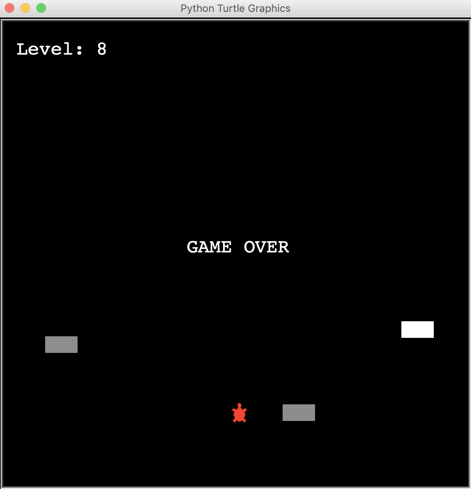

# Python Projects

## Rock Paper Scissors
Command Line Game

short version  

## Scraping Project: Guess the Quote Game
Command Line Game
Scraping the website http://quotes.toscrape.com/ for quotes and saving them to a .csv file. The game logic: guess who said the famous quote, by having 3 hints. 

## Scraping Project: Books Scraper
Books titles, ratings and price scraped from http://books.toscrape.com/catalogue/category/books/history_32/index.html and inserted in sqlite3 db.

## Scraping Project: Public Holidays Austria Scraper
Austrian Public Holidays, Day and Name of the Holiday scraped from https://zentrum-online.at/gesetzliche-feiertage-oesterreich-2018/ 

## Hangman Game
Command Line Game

## Blackjack Game
Command Line Game

## Higher Lower Game
Command Line Game

## Coffee Shop
Command Line Coffee Shop

## Quiz Game
Command Line Game - Classes basics

## Turtle Game
Simple Graphical Betting Game

## Snake Game 
Classic Snake Game

## Pong Game
Classic Pong Game

## Turtle_Crossing_Road_Game
Classic Game
